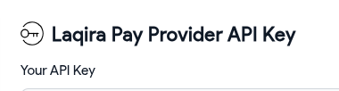

## LaqiraPay 
Laqira Pay is a secure and efficient cryptocurrency payment gateway, enabling businesses to accept digital payments seamlessly with advanced blockchain technology.
https://laqirapay.com


## Requirements

Requires at least: `6.2`

Tested up to: `6.5.2`

Requires PHP: `8.1`

## Live Demo 

https://tobtc.com

## ABSTRACT
LaqiraPay is a decentralized asset-agnostic, multi-network payment gateway with enhanced flexibility and security through blockchain technology, offering transparent financial statements and in-app wallet features for users.

#### HOW LAQIRAPAY WORKS
LaqiraPay's operation involves provider registration, financial statement generation, plugin setup and customer payment processing, ensuring a seamless workflow.

#### PROVIDER REGISTRATION
Providers register on LagiraPay and receive a dedicated smart contract address analogous to an API key in which transparent financial records will be carved.

#### PLUGIN SETUP
Post-registration, providers install the LaqiraPay plugin, input their API key, and get ready for accepting cryptocurrency payments.

#### CUSTOMER PAYMENT
Customers select LaqiraPay method in payment section, choose a network and cryptocurrency, connect their wallet, press "pay" and await confirmation.

#### FEATURES:

##### 1. FULLY DECENTRALIZED 
LagiraPay is a fully decentralized payment gateway using blockchain technology for secure, anonymous transactions without third-party oversight.
It operates through decentralized applications (DApps) that ensure transparency and eliminate intermediaries, providing a direct, immutable, and private transaction environment across various functions.

##### 2. PROVIDER'S FINANCIAL STATEMENT

##### 3. IN-APP WALLET

##### 4. DIRECT RECEIVE

##### 5. DIRECT PAY

##### 6. CASHBACK

##### 7. ASSET-AGNOSTIC 
LagiraPay is asset-agnostic, allowing payments in any origin asset and providing stablecoin in destination to providers, ensuring implicit support and flexibility while minimizing risk and maximizing stability.

##### 8.READILY INCLUSIVE
LagiraPay's readily inclusive, asset-agnostic approach allows implicitly acceptance of any cryptocurrency by providers and broadening usage opportunities for various tokens, overcoming challenges faced by both providers and crypto teams.

##### 9. MULTI-NETWORK
LaqiraPay is a multi-network gateway, supporting diverse network payments, with user options dependent on provider acceptance and configuration. Providers are encouraged to embrace multiple networks for broader user access.

##### 10. AUTOMATIC NETWORK DETECTION

##### 11. AUTOMATIC VALID ASSET DETECTION

##### 12. SLIPPAGE

##### 13. CHAINLINK PRICE FEEDS 
Automatic exact amount detection for customer payment and automatic stable coin depeg detection for vendor settlement based on CHAINLINK’s decentralized price feeds.

## Features

- user can select Networks.
- user can select assest to pay.
- use metamask,ConnectWallet,Trustwallet 


## Installation ()


#### 1. Prerequisite

    Make sure WooCommerce is installed, configured, and ready to use on your WordPress site.

#### 2. Install the Plugin

    Go to Plugins → Add New → Upload Plugin in your WordPress dashboard.

    Upload the LaqiraPay plugin .zip file.

    After installation, click Activate.

#### 3. Configure Settings

- Once the plugin is activated, go to its settings and fill in the following fields:

- Laqira Contract Address:

    `0x52ab753dd301e4fb5bf00d9bfeb55e356a44064d`


- Laqira RPC Url:

    `https://bsc-dataseed.binance.org`


- WalletConnect Project ID:

    `57c157d7249ecf6e78dc45ede079eb07`


- API Key: Obtain from laqirapay.com

#### 4. How to Get Your API Key

    Go to laqirapay.com and click Sign Up.

    You will be redirected to laqirahub.com.

    Connect your cryptocurrency wallet and click Register.

    Create a new Provider and enable it on the networks you want to use.

    Navigate to Manage Provider.

    Copy the value from Laqira Pay Provider API Key.

    This API Key serves as your unique provider address. Any payments made through your WooCommerce store will be directly deposited into this account.


**Minimum Requirements:**

- PHP version 8.1 or higher

- WordPress version 6.2 or higher

- WooCommerce version 8.2 or higher

**Default Setting:**

- Laqira Contract Address : `0x52ab753dd301e4fb5bf00d9bfeb55e356a44064d`

- Laqira RPC Url : `https://bsc-dataseed.binance.org`

- API Key : Go to https://laqirapay.com

    


- WalletConnectProjectID : `57c157d7249ecf6e78dc45ede079eb07`


#### Compatibility
The plugin is compatible with WordPress version `6.2` and PHP versions `8.1` and higher.

#### Limitations
The plugin may not be compatible with older versions of WordPress and PHP.

## Compatibility

LaqiraPay has been tested and confirmed to be compatible with the following plugins and themes:

### Plugins

- [WooCommerce 8.2](https://wordpress.org/plugins/woocommerce/)
- [WPML](https://wpml.org/)
- [elementor / elementor pro v3.21.0 Tested](https://elementor.com/)
- [WPBakery-page-builder 6.5.0 (Visual Composer)](https://visualcomposer.com/)
- [Yoast SEO](https://wordpress.org/plugins/wordpress-seo/)


### Themes

- [Astra](https://wpastra.com/)
- [OceanWP](https://oceanwp.org/)
- [Avada](https://avada.io/)


## Upgrade Notice

Include any important upgrade information here.

## Translations
- English (en_US)
- Chinese (zh_CN)
- Hindi (hi_IN)
- Spanish (es_ES)
- Italian (it_IT)
- Turkish (tr_TR)

## Support

For support or bug reports, please visit the support forum.

## Credits

- https://laqira.io
- https://laqirapay.com
- https://laqirahub.com

## Development

Install dependencies and run the quality toolchain with Composer scripts:

```bash
composer install
composer rector
composer phpcs -- --extensions=php
composer phpunit
```

Use these commands locally or in CI to ensure Rector, PHP_CodeSniffer, and the test suite all pass before merging.

Tags: `wordpress`, `woocommerce`, `web3`, `woocommerce-plugin`, `woocommerce-payment`, `metamask`, `woocommerce-payment-gateway`, `crypto-payment`, `cryptopayments`, `cryptocurrency-payments`, `wordpress-payments`, `crypto-payments`, `blockchain-payments`, `crypto-payment-gateway`, `metamask-payment`, `web3-payments`,
`wordpress-crypto-payments`
